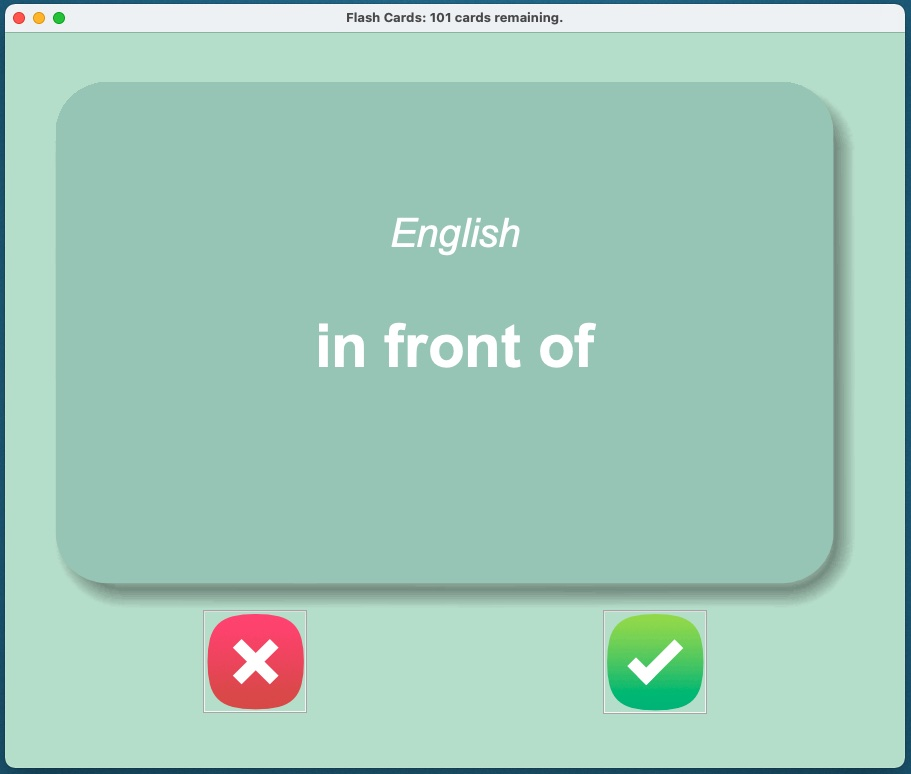

# Language Flash Cards

A graphical flash card game made with Python, Pandas and Tkinter.  Currently set up to use French and English words 
but could be easily modified to accept any flashcard data in csv file format. 

If you knew the word, click the green ✅ and it will remove that word from the list. If you didn't, click the red ❌ 
and it will be returned to the deck.

User progress is saved to `words_to_learn.csv` so you can pick up where you left off the next time. 

